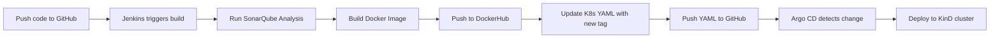

# Ultimate CI/CD Pipeline with Jenkins, SonarQube, Docker, and Argo CD


This project demonstrates a fully automated CI/CD pipeline using **Jenkins**, **SonarQube**, **Docker**, and **Argo CD** running locally with **Docker Compose** and **Kubernetes (KinD)**. It’s a complete developer-centric DevOps setup where every code change triggers a Jenkins build, performs quality checks, builds a Docker image, pushes it to Docker Hub, and then deploys it automatically to a local Kubernetes cluster managed by Argo CD.
Prerequisites:

---

## Local Setup Instructions

1. **Start Jenkins, SonarQube, and Postgres:**

```bash
docker network create cicd
docker compose up -d
```

2. **Access:**
   - Jenkins: [http://localhost:8080](http://localhost:8080)
   - SonarQube: [http://localhost:9000](http://localhost:9000)
  
3. Configure SonarQube
   - Open: http://localhost:9000
   - Login: admin / admin
   - Go to: My Account → Security → Generate Token
   - Save this token for Jenkins
  
4. Configure Jenkins
   - Open: http://localhost:8080
   - Unlock Jenkins with the admin password printed in the logs
   - Install required plugins - Docker Pipeline, SonarQube Scanner
   - Create Jenkins credentials - GITHUB_TOKEN, docker-hub-creds, SONAR_TOKEN
  
5. Create a Jenkins Pipeline Job
   - Go to Jenkins Dashboard → New Item → Pipeline
   - Name it ci-pipeline
   - Choose Pipeline and click OK.
   - In the job configuration:
       - Set Pipeline definition to Pipeline script from SCM
       - SCM: Git
       - Repo URL: Fork and use URL of this repo
       - Branch: main
       - Script Path: Jenkinsfile

6. **Setup KinD:**


```bash
kind create cluster --name dev
kubectl config use-context dev
```

4. **Install Argo CD via Operator or Helm and configure it**
   
5. **Run Jenkins Pipeline**

---
## Automation Flow

---

## Inspiration & Credits

Big thanks to **Abhishek Veeramalla** for his amazing [Jenkins-Zero-To-Hero](https://github.com/iam-veeramalla/Jenkins-Zero-To-Hero) project which inspired this setup.  

---
